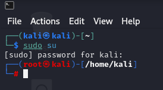
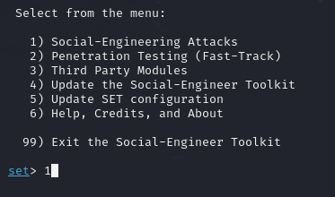
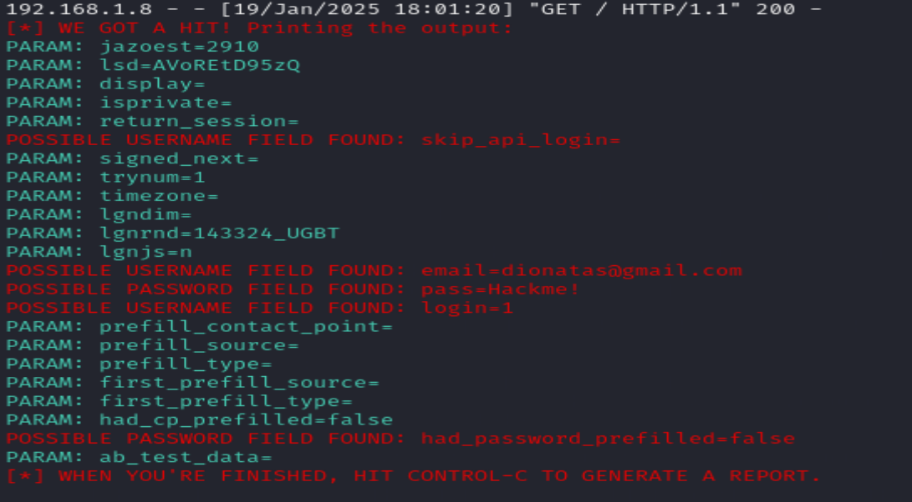

# Phishing to catch passwords from Facebook "School project"

### Tools

- VirtualBox
- Kali Linux "VM to configure the phishing"
- setoolkit
- Windows 10 "I create another VM to test the chalenge"

### Configuring Phishing in Kali Linux

- Open your VM with Kali Linux
- Access the Linux Terminal
- Access root: ``` sudo su ```



- Starting setoolkit: ``` setoolkit ```



- Tipo de ataque: ``` Social-Engineering Attacks ```


- Vetor de ataque: ``` Web Site Attack Vectors ```

- Método de ataque: ```Credential Harvester Attack Method ```

- Método de ataque: ``` Site Cloner ```

- Obtendo o endereço da máquina: ``` ifconfig ```

- URL para clone: http://www.facebook.com


### Resuts


