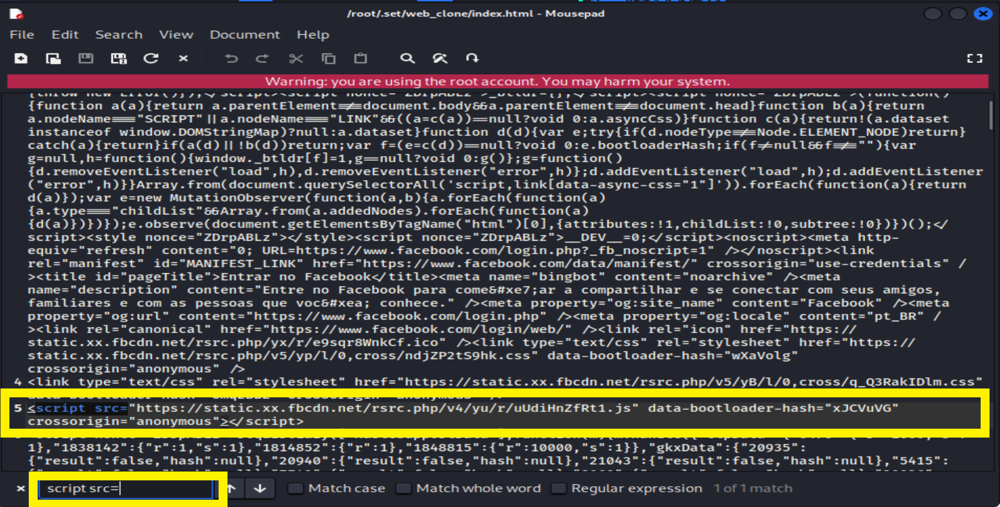

# Ferramenta Phishing para capturar usuário e senha do Facebook "Projeto Escolar"

### Ferramentas

- VirtualBox
- Kali Linux "VM to configure the phishing"
- setoolkit
- Windows 10 "I create another VM to test the chalenge"

### Configurando o Phishing com o Kali Linux

- Open your VM with Kali Linux
- Access the Linux Terminal
- Access root: ``` sudo su ```


- Starting setoolkit: ``` setoolkit ```


- Tipo de ataque: ``` Social-Engineering Attacks ```


- Vetor de ataque: ``` Web Site Attack Vectors ```


- Método de ataque: ```Credential Harvester Attack Method ```


- Método de ataque: ``` Site Cloner ```


- Obtendo o endereço da máquina: ``` 192.168.1.26 ```


- URL para clone: http://www.facebook.com


- URL para site clone: 192.168.1.26


### Resutado


### Resolução de Problema para o caso de digitar o usuário e senha o setoolkit não salvar

- Configure normalmente o ``` setoolkit ``` seguindo os passos acima

- Quando der essa mensagem final


- Abra o navegador de arquivos

- Vá em File System

- Clique com o botão direito e clique abrir como ``` root ```


- Navegue até a pasta ``` /root/.set/web_clone/ ```


- Clique com o botão direito e ``` Abra com o "Mousepad" ```


- Procure no arquivo aberto ``` Ctrl+F ```
- Digite ``` script src= ```



- Exclua a linha e salve o arquivo ``` Ctrl+S ```


### Qualquer dúvida estou a disposição

### Creditos

- URL para clone: https://github.com/Weslley22Marques/cibersecurity-desafio-phishing

- URL para clone: http://ai.zendev.com.br/proof.mp4
